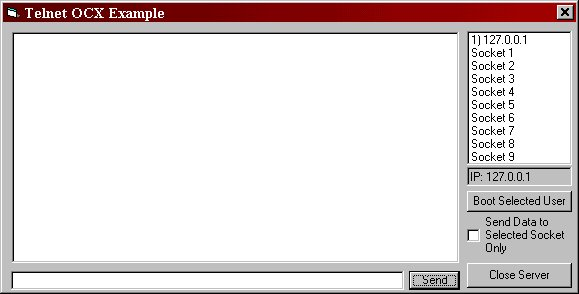



## Telnet Server OCX and example of how to use\.

### Description

This is an OCX which opens up a server on your chosen port and it can accept however many users you chose it to. The server is accessible through any telnet client and handles backspacing.

Both OCX and example are fully commented.

Please Vote.

-Paul Blower
 
### More Info
 

             |
---                |---
**Submitted On**   |2001-02-12 16:23:54
**By**             |[Mercior](https://github.com/Planet-Source-Code/PSCIndex/blob/master/ByAuthor/mercior.md)
**Level**          |Advanced
**User Rating**    |5.0 (15 globes from 3 users)
**Compatibility**  |VB 6\.0
**Category**       |[Custom Controls/ Forms/  Menus](https://github.com/Planet-Source-Code/PSCIndex/blob/master/ByCategory/custom-controls-forms-menus__1-4.md)
**World**          |[Visual Basic](https://github.com/Planet-Source-Code/PSCIndex/blob/master/ByWorld/visual-basic.md)
**Archive File**   |[CODE\_UPLOAD149282132001\.zip](https://github.com/Planet-Source-Code/mercior-telnet-server-ocx-and-example-of-how-to-use__1-20980/archive/master.zip)

